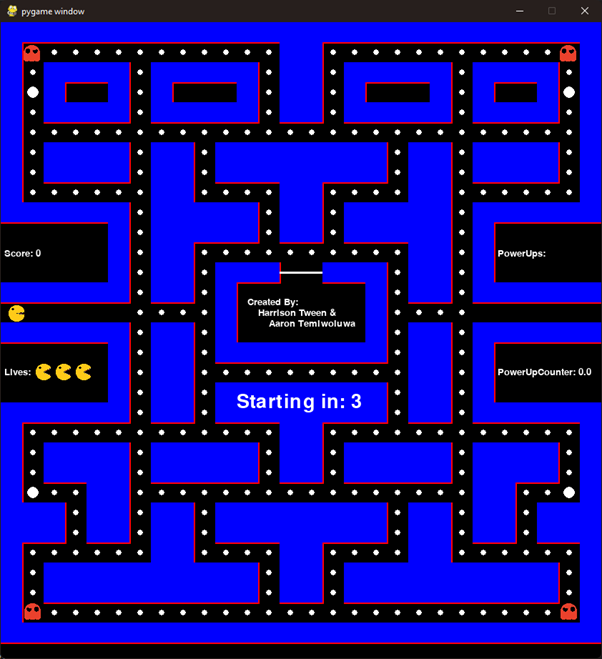
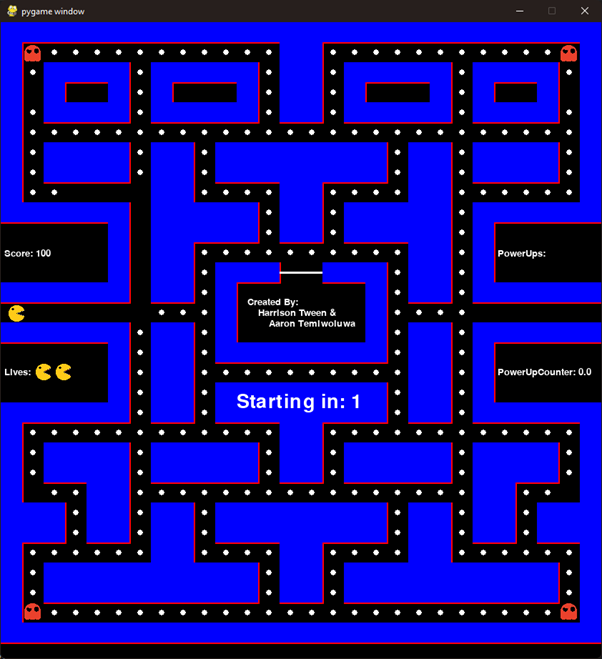
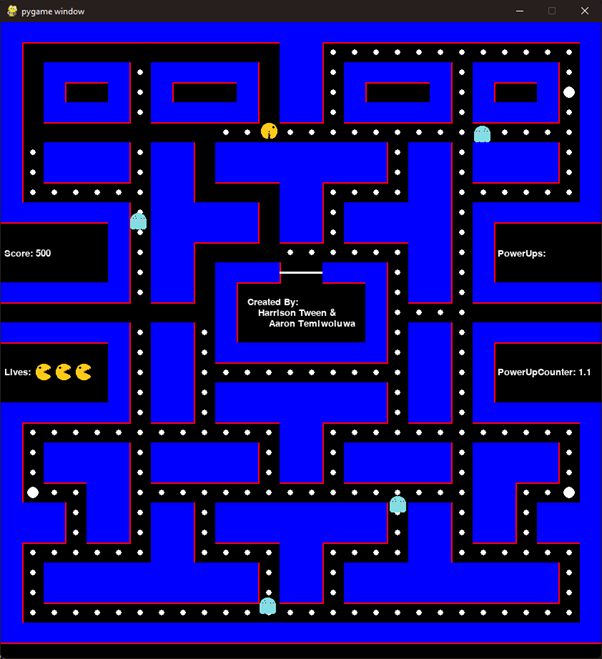
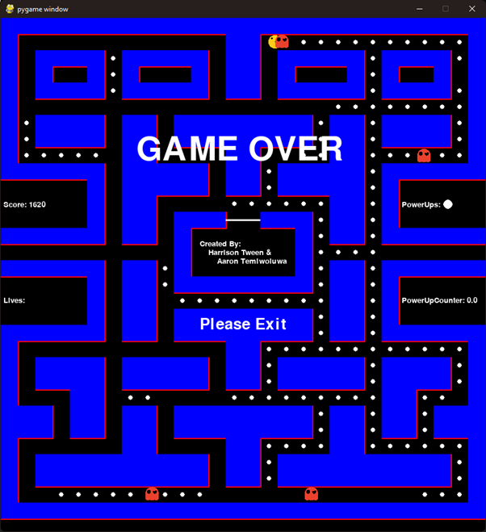
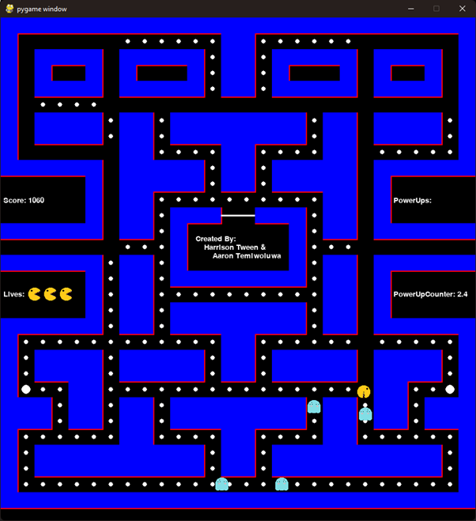
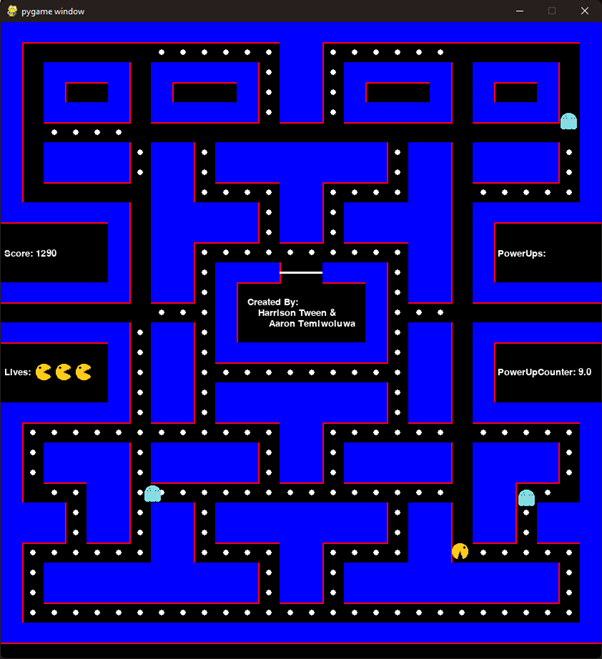
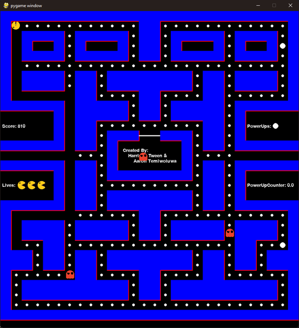
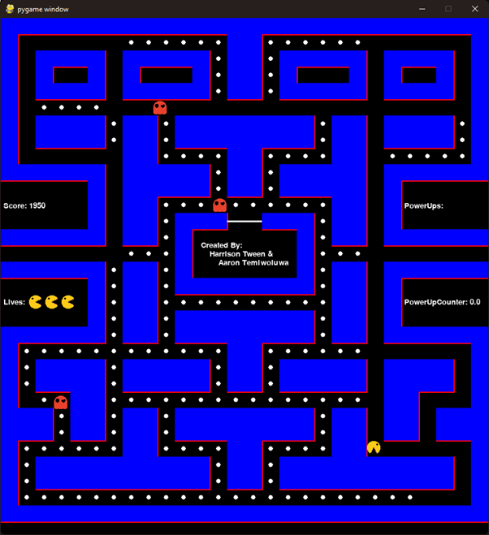

# Pac-Man Requirements

* Harrison Tween
* Aaron Temiwoluwa

## Description

In this game, the character "Pac-Man" will be able to move around a maze using arrow keys whilst trying to avoid the ghosts. There will also be pellets to pick up which will increase the score and cherries which can be used to eat the ghost.

## User Requirements

1. The user can move around the screen, following the path on the screen.
2. Ghosts (opposition) will be moving around randomly through the same paths. 
3. If the ghost touches Pac-Man, the game resets and a life is lost. Pac-Man will be 2 spare lives.
4. Pellets will be scattered around the paths. Collecting them will increase your score. 
5. There will also be cherries that can be picked up and stored, allowing Pac-Man to eat the ghosts. This effect will last for 10 seconds and then the game will revert back to normal.
6. Once all the pellets are gone, the game will end and the score will be displayed. The user will then be prompted to exit the game with a button.

## Proposed Development

* IDE: Visual Studio Code
* Programming Language: Python
* Game Engine: pygame

## Requirements

* Python 3.9
* Install required dependencies (Read below)

## Installing the python packages

Using the virtual environment manager of your choice (venv, conda, etc.), install the python packages

`pip install -r requirements.txt`

## Testing

Throughout the development of pacman, testing had to be done to make sure the entire program works.

### Pacman starting countdown test

This test was to see if the countdown timer would decrease over 3 seconds while there was no movement, then when the timer was done, the game would begin.
This test was successful.

### Pacman starting countdown test

This test was to see when pacman lost a life, the life counter would decrease and the position of pacman, the ghost would reset and the countdown timer would start again.
This test was successful.

### Activating power-up test

This test was to see when the player activated a power-up, the ghost would change direction as well as change to a different picture.
This test was successful.

### Colliding with a ghost on players last life test

This test was to see when a player collided with a ghost on their last life, the game would end with a game ending screen.
This test was successful.

### Colliding with a ghost while power-up active test

This test was to see when a player collided with a ghost during a power-up, the ghost would be eaten and the score would increase.
This test was successful.

### Ghost respawn test

This test was to see when the ghost respawns, its only movement is to move out of the box, then resume normal movement.
This test was successful.
